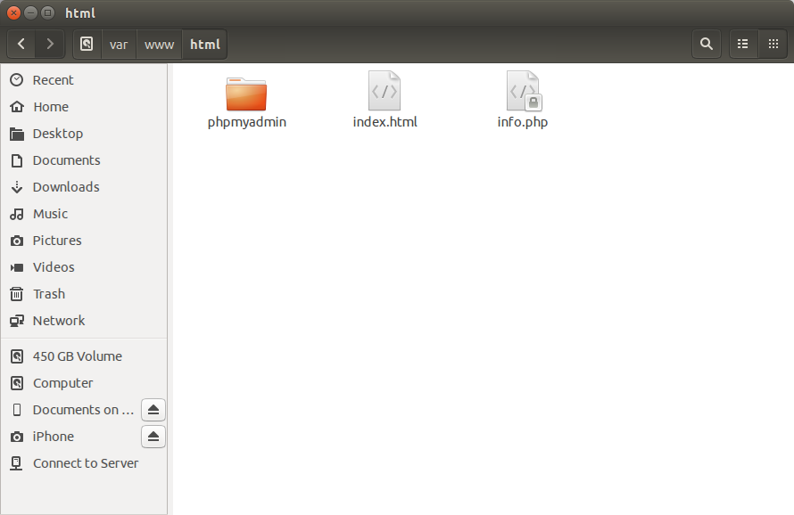
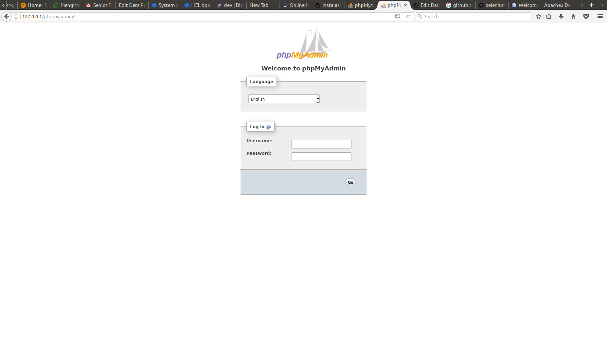

Pada tutorial kali ini, saya akan menjelaskan cara instalasi perlengkapan coding java berupa :
- Instalasi JDK 8
- Instalasi Maven
- Instalasi Maria DB dan PhpMyAdmin

### Instalasi JDK 8 di Linux

JDK dan JRE yang akan kita gunakan adalah OpenJDK. Beberapa developer sedikit kebingungan untuk menggunakan OpenJDK dikarenakan font yang digunakan pada OpenJDK masih acak - acakan. Untuk mengatasi masalah tersebut, pada artikel ini akan dibahas sedikit bagaimana cara mengatasi masalah font OpenJDK pada ubuntu. Silahkan tambahkan PPA berikut untuk kebutuhan ```font infinality```
```sh
$ sudo add-apt-repository ppa:no1wantdthisname/ppa
```
Selanjutnya lakukkan update dengan cara 
```sh
$ sudo apt-get update
```
kemudian lakukan instalasi font infinality seperti berikut.
```sh
$ sudo apt install libfreetype6 fontconfig-infinality
```
Lakukkan konfigurasi font infinality
```sh
$ sudo rm /etc/fonts/conf.avail/52-infinality.conf
$ sudo ln -s /etc/fonts/infinality/infinality.conf /etc/fonts/conf.avail/52-infinality.conf
```
Selanjutnya tambahkan ppa openjdk font fix
```sh
$ sudo add-apt-repository ppa:no1wantdthisname/openjdk-fontfix
```
Tambahkan ppa openjdk
```sh
$ sudo add-apt-repository ppa:openjdk-r/ppa
```
Setelah itu lakukkan instalasi OpenJDK
```sh
$ sudo apt install openjdk-8-jdk openjdk-8-jre icedtea-8-plugin icedtea-plugin
```

setelah proses instalasi selesai lakukkan instalasi untuk build-tools, ada beberapa macam build-tools yaitu :
- [Maven](https://maven.apache.org/)
- [Gradle](https://gradle.org/)
- [Ant](https://ant.apache.org/)
- [Sbt](https://scala-sbt.org/)

Untuk tutorial ini kita hanya menggunakan maven sebagai build-tool 

## Instalasi Maven sebagai Build tool

Download [Maven](https://maven.apache.org/) selanjutnya lakukkan path pada environtment sebagai berikut :
```sh
$ sudo gedit /etc/environment
```
kemudian masukkan kode dipaling atas sebagai berikut 
```sh
JAVA_HOME= /usr/lib/jvm/java-8-openjdk-amd64
M2_HOME= /home/telkom-dds/programming/build-tool/apache-maven

PATH= "/usr/local/sbin:/usr/local/bin:/usr/sbin:/usr/bin:/sbin:/bin:/usr/games:/usr/local/games:/usr/lib/jvm/java-8-openjdk-amd64/bin:/home/telkom-dds/programming/build-tool/apache-maven/bin"
```
sesuaikan dengan path kalian.

kemudian lakukkan pengecekan dengan perintah sebagai berikut 
```sh
$ java -version
$ mvn -version
```
## Instalasi IDE

Ada beberapa IDE yang digunakan oleh developer java

- [NetBeans](https://netbeans.org/)
- [Eclipse](https://www.eclipse.org/)
- [InteliJ IDEA](https://www.jetbrains.com/idea/)

### Instalasi NetBeans
Download NetBeans pada [NetBeans](https://netbeans.org/), lalu beri akses eksekusi dengan perintah chmod a+x netbeans.sh. jalankan dengan perintah ./netbeans maka akan muncul GUI instalasi netbeans.

### Instalasi Eclipse
Silahkan download pada [Eclipse](https://www.eclipse.org/), ekstrak folder tersebut lalu beri akses eksekusi dengan perintah chmod a+x eclipse.sh. dan jalankan eclipse dengan perintah ./eclipse. Untuk memudahkan, maka buatlah shortcut untuk IDE tersebut.

### Instalasi InteliJ IDEA
Download IDE tersebut pada [InteliJ IDEA](https://www.jetbrains.com/idea/), lalu ekstrak pada folder tertentu. Di dalam folder tersebut terdapat folder bin yang di dalamnya terdapat file idea.sh, beri akses eksekusi dengan perintah chmod a+x idea.sh lalu jalankan file tersebut dengan perintah ./idea.sh Secara otomatis IDE tersebut akan membuat shortcut pada linux anda.

Setelah berhasil instalasi ide, tahap selanjutnya adalah instalasi web server dan Maria DB

## Instalasi Apache Web Server
> Apache web server adalah server web yang dapat dijalankan di banyak sistem operasi (Unix, BSD, Linux, Microsoft Windows dan Novell Netware serta platform lainnya) yang berguna untuk melayani dan memfungsikan situs web. Protokol yang digunakan untuk melayani fasilitas web/www ini menggunakan HTTP.

selanjutnya lakukkan instalasi apache seperti berikut
```sh
$ sudo apt-add-repository ppa:ondrej/apache2
$ sudo apt-get update
$ sudo apt-get install apache2
```
Jika berhasil lakukkan akses ke web browser
```sh
$ http://127.0.0.1/
```


## Instalasi Maria DB
> Mariadb adalah produk fork dari MySQL yang didukung langsung dari community. Sejak diakuisisinya MySQL oleh Oracle pada September 2010, Monty Program sebagai penulis awal kode sumber MySQL memisahkan diri dari pengembangan dan membuat versi yang lebih sendiri yakni MariaDB.

Lasung saja lakukkan instalasi Maria DB sebagai berikut :
```sh
$ sudo apt-get install software-properties-common
$ sudo apt-key adv --recv-keys --keyserver hkp://keyserver.ubuntu.com:80 0xF1656F24C74CD1D8
$ sudo add-apt-repository 'deb [arch=amd64,i386] http://mariadb.biz.net.id/repo/10.1/ubuntu xenial main'
$ sudo apt-get update
$ sudo apt-get install mariadb-server mariadb-client
```
Jika instalasi telah selesai, anda dapat mengakses mariadb dengan perintah
```sh
$ mysql -u root -p
```
## Instalasi PhpMyAdmin
> phpMyAdmin adalah perangkat lunak bebas yang ditulis dalam bahasa pemrograman PHP yang digunakan untuk menangani administrasi MySQL. phpMyAdmin mendukung berbagai operasi MySQL, diantaranya (mengelola basis data, tabel-tabel, bidang (fields), relasi (relations), indeks, pengguna (users), perijinan (permissions), dan lain-lain).

Download [PhpMyAdmin](https://www.phpmyadmin.net/) pilih yang phpMyAdmin-4.5.2-all-languages.tar.xz kemudian extrak dan rename foldernya dengan phpmyadmin, hasilnya ektraknya silahkan anda copy ke folder /var/www/html/ kemudian akses pada http://127.0.0.1/phpmyadmin/ maka akan muncul halaman phpmyadmin seperti berikut ini.
[](https://nodesource.com/products/nsolid)


arahkan ke web browser
```sh
127.0.0.1/phpmyadmin
```


Jika ada error seperti ini

Maka lakukkan kode seperti berikut 
```sh
sudo systemctl restart apache2
```
Arahkan lagi ke web browser dan berhasil :)

